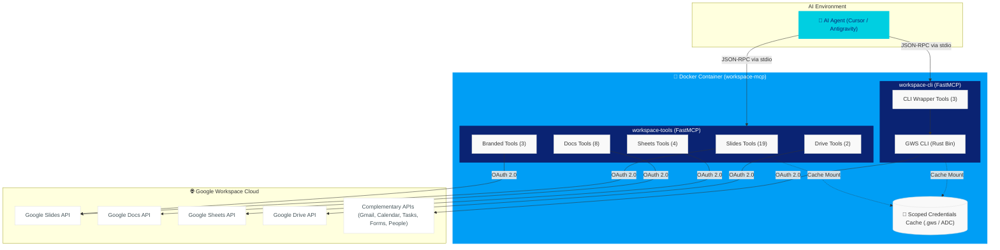
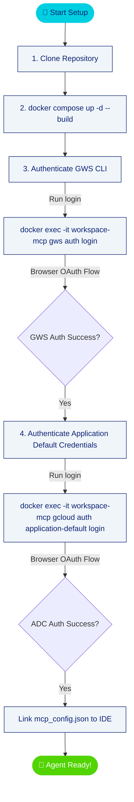

# Vopak Workspace MCP

[](https://www.python.org/)
[](https://www.docker.com/)
[](#tool-inventory)
[](#development)
[](LICENSE)

Automate Google Workspace with AI Agents. Connect Slides, Docs, Sheets, and Drive directly to your LLM context via Model Context Protocol (MCP).

*We help the world flow forward >*

***


## Overview

**Vopak Workspace MCP** is a standalone Python-based Model Context Protocol (MCP) server container designed to equip AI coding agents (such as Antigravity, Cursor, and Windsurf) with native, granular capabilities to read, write, format, and audit Google Workspace documents.

By running locally in a single Docker container, it bypasses the need for complex enterprise-level GCP deployments, providing developers and their AI agents with instant access to:
1. **`workspace-tools` (36 granular tools)**: Deep, structured APIs for Slides, Docs, Sheets, and Drive, including slide design layout generators and document builders.
2. **`workspace-cli` (3 tools)**: A secure, verb-gated universal CLI wrapper acting as an escape hatch for Gmail, Calendar, Tasks, Forms, and People.

***

## System Architecture

The project operates under a hybrid containerized model. The Docker container runs both MCP servers concurrently over standard input/output (stdio), orchestrating API requests via the official Google API Client and executing CLI interactions via a compiled binary of the Google Workspace CLI (`gws`).



***

## Setup Options: Granular Tools vs. CLI-Only

This repository allows you to choose between running **both servers** (recommended for full functionality) or running a **minimal CLI-only setup**. 

| Setup Type | Enabled Servers | Credentials Needed | Best For | Trade-offs |
| :--- | :--- | :--- | :--- | :--- |
| **Full Setup** *(Default)* | `workspace-tools` & `workspace-cli` | `gws` OAuth + `gcloud` Application Default Credentials | Precise document manipulation (Slides, Docs, Sheets, Drive) + CLI fallbacks | Requires double authentication step (GWS + gcloud). |
| **CLI-Only Setup** | `workspace-cli` only | `gws` OAuth only | Lightweight automations (Gmail, Calendar, Tasks, Forms, People) | Agent runs raw CLI commands instead of structured APIs. **Requires CLI Reference Skill.** |

### Running CLI-Only Setup
If you want to keep your setup lightweight and bypass the Google Cloud SDK (`gcloud`) setup, you can disable `workspace-tools` in your IDE configuration and only authenticate the GWS CLI:

1. In your `mcp_config.json`, remove the `workspace-tools` server block.
2. Only run the GWS CLI login step during authentication (`docker exec -it workspace-mcp gws auth login`).

> [!WARNING]
> If you choose the **CLI-Only Setup**, you **MUST** import the [gws_cli_reference SKILL](skills/gws_cli_reference/SKILL.md) into your AI Agent's instructions profile (or copy its contents directly into your system instructions).
> Because the CLI wrapper is an "escape hatch" with untyped string inputs, AI agents do not natively know the valid syntax parameters for the `gws` tool CLI commands. Improving the Agent's context with this reference skill ensures they can format calls for Gmail, Calendar, Tasks, etc., without syntax errors.

***

## Quick Start Setup

Configure and launch your Vopak Workspace MCP environment in 4 steps:



### 1. Clone the Repository
```bash
git clone https://github.com/patriciosantamaria/vopak-workspace-mcp.git
cd vopak-workspace-mcp
```

### 2. Build & Launch Container
Spawn the background services. The Dockerfile compiles the latest GWS CLI binary and installs Python dependencies:
```bash
docker compose up -d --build
```

### 3. Google Workspace Authentication (One-time Setup)
Log in to your Google Account. Copy the URL generated by each command into your browser, grant the permissions, and paste the authorization code back:

*   **Authenticate GWS CLI** (for Gmail, Calendar, and CLI-based tools):
    ```bash
    docker exec -it workspace-mcp gws auth login
    ```
*   **Authenticate Python APIs** (for Slides, Docs, Sheets, and Drive):
    ```bash
    docker exec -it workspace-mcp gcloud auth application-default login
    ```

### 4. Link Configuration to your IDE
Copy the content of `mcp_config.example.json` and paste it into your local IDE settings (e.g. Cursor MCP configuration or Antigravity's `mcp_config.json`):

```json
{
  "mcpServers": {
    "workspace-tools": {
      "command": "docker",
      "args": ["exec", "-i", "workspace-mcp", "python", "-m", "src.servers.workspace_tools"],
      "timeout": 30
    },
    "workspace-cli": {
      "command": "docker",
      "args": ["exec", "-i", "workspace-mcp", "python", "-m", "src.servers.workspace_cli"],
      "timeout": 30
    }
  }
}
```

***

## Tool Inventory

### Server 1: `workspace-tools` (36 Granular Tools)

Highly optimized, typed Python tools mapping directly to Google APIs.

| Module | Tools | Primary Focus | Representative Tools |
| :--- | :---: | :--- | :--- |
| **Slides** | **19** | Complete lifecycle management of Google Slides | `slides_get_slide_content`, `slides_update_text`, `slides_format_text`, `slides_get_thumbnail`, `slides_audit_deck` |
| **Docs** | **8** | Precise document creation, parsing, and modification | `docs_get_structure`, `docs_read_text`, `docs_insert_text`, `docs_find_and_replace`, `docs_delete_text` |
| **Sheets** | **4** | Cell range reads, writes, and readback validation | `sheets_get_structure`, `sheets_read_range`, `sheets_write_from_file`, `sheets_verify_range` |
| **Drive** | **2** | Directory traversal, search, and file copying | `drive_list_files`, `drive_manage_file` |
| **Branded** | **3** | Vopak-compliant template builders and health diagnostics | `create_vopak_presentation`, `create_vopak_document`, `docker_health_check` |

### Server 2: `workspace-cli` (3 Legacy Escape Hatch Tools)

Provides a universal fallback mechanism to query Workspace APIs that lack granular endpoint mappings.

| Tool | Permission | Action Scope | Security Rules |
| :--- | :---: | :--- | :--- |
| `gws_read` | **Read-only** | Google Gmail, Calendar, Tasks, Forms, People | Block list checks, no command chaining |
| `gws_write` | **Write** | Create folders, events, forms, draft emails | Prompt explanation & reason tracking |
| `gws_destructive` | **Destructive** | Delete events, delete files, empty trash | ⚠️ HITL confirmation required |

***

## Security & Scopes

*   **OAuth 2.0 Scope Separation**: Scopes are configured granularly. Slides, Docs, and Sheets access only target files created by this application, or files explicitly chosen by the user.
*   **Command Sanitization**: The CLI Wrapper blocks execution of raw bash syntax, pipe redirects (`|`), and command concatenation (`&&`, `;`).
*   **Human-In-The-Loop (HITL)**: Destructive CLI commands are flagged explicitly with `⚠️ DESTRUCTIVE` inside the tool schemas, forcing the IDE to prompt the user before execution.
*   **PII Anonymization**: Log outputs are scrubbed of user emails, phone numbers, and directory listing details (replaced with `[REDACTED]`).

***

## Development & Testing

This project uses Python 3.11 with [FastMCP](https://github.com/jasonjmcghee/fastmcp) for tool generation and [pytest](https://docs.pytest.org/) for unit testing.

### Local Installation
```bash
# Install package with development dependencies
pip install -e ".[dev]"
```

### Running Tests
Execute the test suite containing 83 mock API and CLI parser verifications:
```bash
pytest
```

### Code Formatting & Linting
Check code quality standards via `ruff`:
```bash
ruff check src/ tests/
```

***

## License

This project is licensed under the MIT License.
