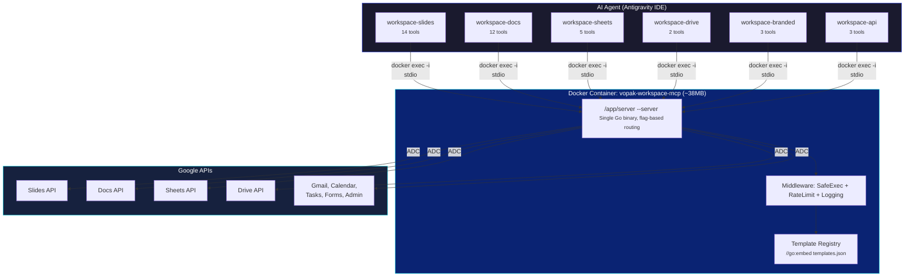

# Vopak Workspace MCP

[](https://go.dev/)
[](https://www.docker.com/)
[](#complete-tool-catalog)
[](LICENSE)

<p align="center">
  <strong>39 MCP tools across 6 servers — Google Workspace content operations in a single Docker container.</strong><br/>
  Slides, Docs, Sheets, Drive, Branded Templates, and a universal Workspace API bridge.
</p>

---

## What Is This?

**Vopak Workspace MCP** is a Go-based [Model Context Protocol](https://modelcontextprotocol.io/) server that gives AI coding agents full, safe access to Google Workspace content APIs. It runs as a single Docker container (~38 MB) and exposes 6 independent MCP server groups:

| Server | Tools | Auth | Purpose |
|:-------|:-----:|:----:|:--------|
| **`workspace-slides`** | 14 | ADC | Create, read, search, format Google Slides presentations |
| **`workspace-docs`** | 12 | ADC | Create, read, search, format Google Docs documents |
| **`workspace-sheets`** | 5 | ADC | Read, write, verify, chart Google Sheets spreadsheets |
| **`workspace-drive`** | 2 | ADC | File listing and folder creation in Google Drive |
| **`workspace-branded`** | 3 | ADC | Branded Vopak content creation from templates |
| **`workspace-api`** | 3 | ADC | Universal REST bridge for Gmail, Calendar, Tasks, Forms, etc. |

**You choose what to install.** Each server group runs as a separate `--server` flag on the same binary. Install all 6 for full coverage, or just the ones you need.

---

## Architecture



### Key Design Decisions

- **Single binary** — One Go binary with `--server` flag routing to 6 server groups
- **Embedded templates** — `//go:embed templates.json` compiles 17 templates into the binary (no mounted volumes)
- **Middleware chain** — Every tool call goes through `SafeExec` (panic recovery) → `RateLimit` (5 req/s) → structured JSON logging
- **Standard responses** — All tools return `AgentResult{ success, message, data, error_code }`
- **ADC authentication** — Application Default Credentials with per-scope caching

---

## Quick Start

### 1. Clone and Build

```bash
git clone https://github.com/patriciosantamaria/vopak-workspace-mcp.git
cd vopak-workspace-mcp
docker compose up -d --build
```

### 2. Authenticate

```bash
# Application Default Credentials
gcloud auth application-default login
```

ADC credentials are automatically mounted read-only from `~/.config/gcloud/` via `docker-compose.yml`.

### 3. Configure Your IDE

Copy the MCP config into your Antigravity (or other MCP client) configuration:

```json
{
  "mcpServers": {
    "workspace-slides": {
      "command": "docker",
      "args": ["exec", "-i", "vopak-workspace-mcp", "/app/server", "--server", "slides"],
      "timeout": 30
    },
    "workspace-docs": {
      "command": "docker",
      "args": ["exec", "-i", "vopak-workspace-mcp", "/app/server", "--server", "docs"],
      "timeout": 30
    },
    "workspace-sheets": {
      "command": "docker",
      "args": ["exec", "-i", "vopak-workspace-mcp", "/app/server", "--server", "sheets"],
      "timeout": 30
    },
    "workspace-drive": {
      "command": "docker",
      "args": ["exec", "-i", "vopak-workspace-mcp", "/app/server", "--server", "drive"],
      "timeout": 30
    },
    "workspace-branded": {
      "command": "docker",
      "args": ["exec", "-i", "vopak-workspace-mcp", "/app/server", "--server", "branded"],
      "timeout": 30
    },
    "workspace-api": {
      "command": "docker",
      "args": ["exec", "-i", "vopak-workspace-mcp", "/app/server", "--server", "api"],
      "timeout": 30
    }
  }
}
```

See [`mcp_config.example.json`](mcp_config.example.json) for the full reference.


---

## Complete Tool Catalog

### Server 1: `workspace-slides` (14 tools)

| # | Tool | Type | Description |
|:-:|:-----|:----:|:------------|
| 1 | `slides_get_content` | Read | Full slide content: text, positions, styles, placeholder types |
| 2 | `slides_list` | Read | List all slides with metadata (IDs, titles, dimensions) |
| 3 | `slides_search_text` | Read | Full-text search across entire presentation with context |
| 4 | `slides_get_thumbnail` | Read | PNG thumbnail URL for visual QA verification |
| 5 | `slides_read_table` | Read | Table structure: rows, columns, cell content |
| 6 | `slides_replace_text` | Write | Find and replace text (single or bulk replacements) |
| 7 | `slides_insert_image` | Write | Insert image by URL with position and size |
| 8 | `slides_insert_chart` | Write | Generate chart via QuickChart.io and insert as image |
| 9 | `slides_update_cell` | Write | Update text in a specific table cell |
| 10 | `slides_add` | Write | Add a new slide from a layout |
| 11 | `slides_duplicate` | Write | Clone a slide at a specified position |
| 12 | `slides_reorder` | Write | Move slides to new positions |
| 13 | `slides_batch_update` | Write | Raw Slides API batch update (escape hatch) |
| 14 | `slides_delete` | **DESTRUCTIVE** | Permanently delete a slide |

### Server 2: `workspace-docs` (12 tools)

| # | Tool | Type | Description |
|:-:|:-----|:----:|:------------|
| 1 | `docs_read_text` | Read | Extract full text or a section by heading |
| 2 | `docs_get_structure` | Read | Document structure: headings, tables, element tree |
| 3 | `docs_search_text` | Read | Search text patterns across the document |
| 4 | `docs_read_table` | Read | Table structure: rows, columns, cell content |
| 5 | `docs_insert_text` | Write | Insert text at a specific character index |
| 6 | `docs_replace_text` | Write | Find and replace text across the document |
| 7 | `docs_set_style` | Write | Apply formatting (font, size, color, bold) by substring |
| 8 | `docs_insert_image` | Write | Insert inline image at a specific position |
| 9 | `docs_update_cell` | Write | Update text in a specific table cell |
| 10 | `docs_add_table_row` | Write | Append a row to an existing table |
| 11 | `docs_insert_table` | Write | Create a new table at a specified position |
| 12 | `docs_batch_update` | Write | Raw Docs API batch update (escape hatch) |

### Server 3: `workspace-sheets` (5 tools)

| # | Tool | Type | Description |
|:-:|:-----|:----:|:------------|
| 1 | `sheets_read_range` | Read | Read cell values from a specified range |
| 2 | `sheets_get_structure` | Read | Sheet names, row/column counts, named ranges |
| 3 | `sheets_verify_range` | Write | Write + readback verification (cell-by-cell) |
| 4 | `sheets_write_data` | Write | Write structured data to a sheet range |
| 5 | `sheets_create_chart` | Write | Create a chart in a spreadsheet |

### Server 4: `workspace-drive` (2 tools)

| # | Tool | Type | Description |
|:-:|:-----|:----:|:------------|
| 1 | `drive_list` | Read | Search/list files with filters (folder, MIME type, name) |
| 2 | `drive_create_folders` | Write | Create folder hierarchies recursively |

### Server 5: `workspace-branded` (3 tools)

| # | Tool | Type | Description |
|:-:|:-----|:----:|:------------|
| 1 | `branded_create_presentation` | Write | Copy Vopak Slide template + fill placeholders |
| 2 | `branded_create_document` | Write | Copy Vopak Doc template + fill placeholders |
| 3 | `branded_health_check` | Read | Verify template accessibility and registry integrity |

**Template Registry**: 17 embedded templates (1 presentation + 16 document types) with Drive IDs and placeholder definitions. Compiled into the binary via `//go:embed`.

### Server 6: `workspace-api` (3 tools)

Universal REST bridge for Google Workspace APIs not covered by the granular tools.

| # | Tool | Type | Description |
|:-:|:-----|:----:|:------------|
| 1 | `api_read` | Read | Authenticated GET to any `googleapis.com` endpoint |
| 2 | `api_write` | Write | Authenticated POST/PUT/PATCH to any `googleapis.com` endpoint |
| 3 | `api_delete` | **DESTRUCTIVE** | Authenticated DELETE (requires HITL confirmation) |

**Use for**: Gmail, Calendar, Tasks, Forms, Admin, Groups, People, Chat, Drive permissions/sharing.

**Do NOT use for**: Slides, Docs, Sheets content (use the granular tools instead).

---


---

## Security Model

### Middleware Chain

Every tool call passes through:

```
SafeExec (panic recovery) → RateLimit (5 req/s, burst 10) → Structured Logging → Tool Handler
```

### Safety Tiers

| Tier | Tools | Enforcement |
|:-----|:------|:------------|
| **Read** | `*_get_*`, `*_list`, `*_read_*`, `*_search_*`, `api_read` | No restrictions |
| **Write** | `*_insert_*`, `*_replace_*`, `*_update_*`, `*_create_*`, `api_write` | Standard execution |
| **DESTRUCTIVE** | `slides_delete`, `api_delete` | Tool description includes "DESTRUCTIVE" — IDE requires HITL |

### Authentication

| Method | Scope | Usage |
|:-------|:------|:------|
| Application Default Credentials (ADC) | Per-API OAuth scopes | All 39 tools |

ADC credentials are mounted read-only from `~/.config/gcloud/` into the Docker container.

---

## Development

### Prerequisites

- Docker and Docker Compose
- Google Cloud project with Workspace APIs enabled
- `gcloud auth application-default login` completed

### Build

```bash
docker compose build
```

The Go binary is compiled inside a multi-stage Docker build (no local Go installation required).

### Project Structure

```
vopak-workspace-mcp/
├── cmd/server/main.go              # Entrypoint — flag-based server routing
├── internal/
│   ├── workspace/
│   │   ├── auth.go                 # ADC credential factory with per-scope caching
│   │   └── clients.go              # Lazy-init API client factories
│   ├── middleware/
│   │   ├── safeexec.go             # Panic recovery wrapper
│   │   ├── ratelimit.go            # Token bucket rate limiter
│   │   ├── logging.go              # Structured JSON logging
│   │   └── chain.go                # Middleware composition
│   └── tools/
│       ├── slides/                 # 14 Slides tools (7 files)
│       ├── docs/                   # 12 Docs tools (6 files)
│       ├── sheets/                 # 5 Sheets tools (3 files)
│       ├── drive/                  # 2 Drive tools (2 files)
│       ├── branded/                # 3 Branded tools + templates.json (4 files)
│       └── api/                    # 3 API bridge tools (2 files)
├── pkg/agentresult/result.go       # Standard AgentResult response type
├── config/                         # Configuration files
├── Dockerfile                      # Multi-stage Alpine build (~38MB image)
├── docker-compose.yml              # ADC volume + TEMPLATE_FOLDER_ID
├── mcp_config.example.json         # IDE configuration reference
└── go.mod                          # Go module (SDK v1.6.1)
```

---


---

## License

Apache-2.0
