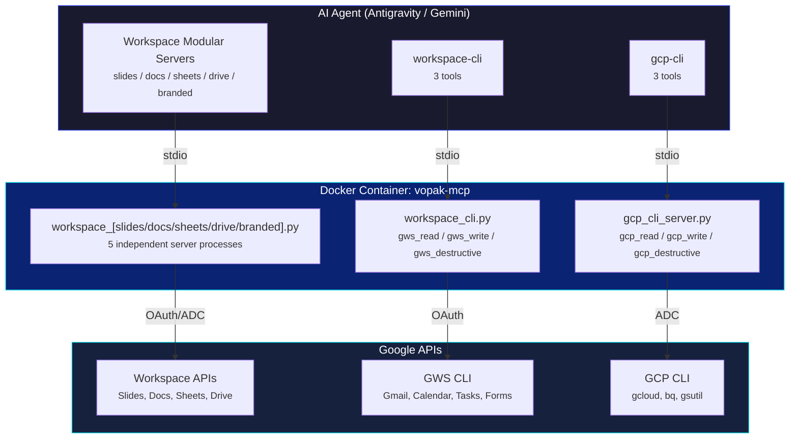

# Vopak MCP

[](https://www.python.org/)
[](https://www.docker.com/)
[](#complete-tool-catalog)
[](tests/)
[](LICENSE)

<p align="center">
  
</p>

<p align="center">
  <strong>42 MCP tools across 3 servers — Google Workspace + GCP in a single Docker container.</strong><br/>
  Slides, Docs, Sheets, Drive, Cloud Run, IAM, Storage, Logging, BigQuery, and more.
</p>

---

## What Is This?

**Vopak MCP** is a collection of custom [Model Context Protocol](https://modelcontextprotocol.io/) servers that give AI coding agents full, safe access to Google Workspace and Google Cloud Platform. It runs as a single Docker container and exposes 3 independent MCP servers:

| Server | Tools | Auth | Purpose |
|:-------|:-----:|:----:|:--------|
| **`workspace-slides`** | 19 | ADC | Granular Google Slides tools (reading, writing, formatting) |
| **`workspace-docs`** | 8 | ADC | Granular Google Docs tools (reading, styling, structure) |
| **`workspace-sheets`** | 4 | ADC | Granular Google Sheets tools (reading, writing, validation) |
| **`workspace-drive`** | 2 | ADC | Google Drive file search and lifecycle management |
| **`workspace-branded`** | 3 | ADC | Branded Vopak Slide/Doc creators and health checks |
| **`workspace-cli`** | 3 | OAuth | GWS CLI wrappers for Gmail, Calendar, Tasks, Forms, People |
| **`gcp-cli`** | 3 | ADC | GCP CLI wrappers for Cloud Run, IAM, Storage, Logging, BigQuery, and more |

**You choose what to install.** Each server is independently configurable. Install all 7 for full coverage, or just the ones you need.

---

## Architecture



---

## Quick Start

### 1. Clone and Build

```bash
git clone https://github.com/patriciosantamaria/vopak-mcp.git
cd vopak-mcp
docker compose up -d --build
```

### 2. Authenticate

```bash
# Google Workspace CLI (OAuth — for workspace-cli server)
docker exec -it vopak-mcp gws auth setup

# GCP (Application Default Credentials — for Workspace servers and gcp-cli)
docker exec -it vopak-mcp gcloud auth application-default login
```

### 3. Verify

```bash
docker exec -it vopak-mcp python -m src.servers.workspace_slides  # Should print server info
docker exec -it vopak-mcp python -m src.servers.workspace_docs    # Should print server info
docker exec -it vopak-mcp python -m src.servers.workspace_sheets  # Should print server info
docker exec -it vopak-mcp python -m src.servers.workspace_drive   # Should print server info
docker exec -it vopak-mcp python -m src.servers.workspace_branded # Should print server info
docker exec -it vopak-mcp python -m src.servers.workspace_cli     # Should print server info
docker exec -it vopak-mcp python -m src.servers.gcp_cli_server    # Should print server info
```

### 4. Configure Your IDE

Copy the MCP config into your Antigravity (or other MCP client) configuration:

```json
{
  "mcpServers": {
    "workspace-slides": {
      "command": "docker",
      "args": ["exec", "-i", "vopak-mcp", "python", "-m", "src.servers.workspace_slides"],
      "timeout": 30
    },
    "workspace-docs": {
      "command": "docker",
      "args": ["exec", "-i", "vopak-mcp", "python", "-m", "src.servers.workspace_docs"],
      "timeout": 30
    },
    "workspace-sheets": {
      "command": "docker",
      "args": ["exec", "-i", "vopak-mcp", "python", "-m", "src.servers.workspace_sheets"],
      "timeout": 30
    },
    "workspace-drive": {
      "command": "docker",
      "args": ["exec", "-i", "vopak-mcp", "python", "-m", "src.servers.workspace_drive"],
      "timeout": 30
    },
    "workspace-branded": {
      "command": "docker",
      "args": ["exec", "-i", "vopak-mcp", "python", "-m", "src.servers.workspace_branded"],
      "timeout": 30
    },
    "workspace-cli": {
      "command": "docker",
      "args": ["exec", "-i", "vopak-mcp", "python", "-m", "src.servers.workspace_cli"],
      "timeout": 30
    },
    "gcp-cli": {
      "command": "docker",
      "args": ["exec", "-i", "vopak-mcp", "python", "-m", "src.servers.gcp_cli_server"],
      "timeout": 60
    }
  }
}
```

See [`mcp_config.example.json`](mcp_config.example.json) for the full reference.

---

## Setup Options

Not every project needs all 42 tools. You can customize which servers to install:

| Setup | Servers | Tools | Best For |
|:------|:--------|:-----:|:---------|
| **Full** | All 7 servers | 42 | Full-stack projects using Workspace + GCP |
| **Workspace Only** | `workspace-slides` + `workspace-docs` + `workspace-sheets` + `workspace-drive` + `workspace-branded` + `workspace-cli` | 39 | Projects that only use Google Workspace |
| **Workspace Granular** | Choose specific modules (slides, docs, sheets, drive, branded) | 2 - 36 | Precision Workspace tasks (e.g. only slides or only drive) |
| **GCP Only** | `gcp-cli` only | 3 | Infrastructure management, Cloud Run, BigQuery |
| **CLI Only** | `workspace-cli` + `gcp-cli` | 6 | Universal CLI access to both Workspace and GCP |

---

## Complete Tool Catalog

The granular Workspace tools are split into 5 focused servers:

### Server 1: `workspace-slides` (19 tools)

Granular tools for reading, writing, and formatting Google Slides presentations.

#### Slides Tools (19)

| # | Tool | Type | Description |
|:-:|:-----|:----:|:------------|
| 1 | `slides_get_presentation` | Read | Presentation metadata: slide count, IDs, titles, page dimensions |
| 2 | `slides_get_slide_content` | Read | All elements from a slide with text, positions, placeholder types |
| 3 | `slides_get_speaker_notes` | Read | Speaker notes from one or all slides with element IDs |
| 4 | `slides_get_element_styles` | Read | Per-run font, bold, italic, color, links for all text elements |
| 5 | `slides_get_comments` | Read | All comments with authors, replies, resolution status |
| 6 | `slides_search_text` | Read | Full-text search across all slides with context snippets |
| 7 | `slides_measure_text_bounds` | Read | Estimate text overflow using font-metric heuristics |
| 8 | `slides_audit_deck` | Read | Batch audit: titles, text, overflow, thumbnails in one call |
| 9 | `slides_get_thumbnail` | Read | PNG thumbnail URL for visual QA verification |
| 10 | `slides_update_text` | Write | Replace text in a specific element |
| 11 | `slides_format_text` | Write | Apply formatting (bold, font, color) to text ranges |
| 12 | `slides_update_and_format_text` | Write | Replace text and apply formatting in one atomic call |
| 13 | `slides_duplicate_slide` | Write | Clone a slide at a specified position |
| 14 | `slides_reorder_slides` | Write | Move slides to new positions |
| 15 | `slides_update_speaker_notes` | Write | Replace speaker notes on a single slide |
| 16 | `slides_bulk_update_speaker_notes` | Write | Update speaker notes on multiple slides in one call |
| 17 | `slides_batch_update` | Write | Raw Slides API batch update (escape hatch) |
| 18 | `slides_delete_slide` | Destructive | Permanently delete a slide |
| 19 | `slides_remove_speaker_notes` | Destructive | Clear speaker notes from a slide |

### Server 2: `workspace-docs` (8 tools)

Granular tools for reading and editing Google Docs structures and styles.

#### Docs Tools (8)

| # | Tool | Type | Description |
|:-:|:-----|:----:|:------------|
| 20 | `docs_get_structure` | Read | Document structure: headings, sections, element tree |
| 21 | `docs_read_text` | Read | Extract plain text from a document |
| 22 | `docs_search_text` | Read | Search for text patterns across the document |
| 23 | `docs_insert_text` | Write | Insert text at a specific position |
| 24 | `docs_update_style` | Write | Apply formatting to text ranges |
| 25 | `docs_append_section` | Write | Append a new section with heading and body |
| 26 | `docs_find_and_replace` | Write | Find and replace text across the document |
| 27 | `docs_delete_text` | Destructive | Delete text at a specific range |

### Server 3: `workspace-sheets` (4 tools)

Granular tools for reading, writing, and verifying cell ranges in Google Sheets.

#### Sheets Tools (4)

| # | Tool | Type | Description |
|:-:|:-----|:----:|:------------|
| 28 | `sheets_read_range` | Read | Read cell values from a specified range |
| 29 | `sheets_get_structure` | Read | Sheet names, row/column counts, named ranges |
| 30 | `sheets_write_from_file` | Write | Bulk write data from JSON to a sheet range |
| 31 | `sheets_verify_range` | Write | Atomic write + readback verification (cell-by-cell) |

### Server 4: `workspace-drive` (2 tools)

Granular tools for file search and lifecycle management in Google Drive.

#### Drive Tools (2)

| # | Tool | Type | Description |
|:-:|:-----|:----:|:------------|
| 32 | `drive_list_files` | Read | List files with structured filters (folder, MIME type, name) |
| 33 | `drive_manage_file` | Write | Create, move, rename, copy, trash, or share Drive files |

### Server 5: `workspace-branded` (3 tools)

Generation of branded Vopak assets and environment health checks.

#### Branded Content Tools (3)

| # | Tool | Type | Description |
|:-:|:-----|:----:|:------------|
| 34 | `create_vopak_presentation` | Write | Generate pixel-perfect Vopak-branded Google Slides |
| 35 | `create_vopak_document` | Write | Generate branded Google Docs from Markdown |
| 36 | `docker_health_check` | Read | Environment, credentials, and dependency verification |

---

### Server 6: `workspace-cli` (3 tools)

Universal CLI wrappers for the [Google Workspace CLI](https://github.com/googleworkspace/cli). Covers Gmail, Calendar, Tasks, Forms, People — anything the granular tools above don't cover.

| # | Tool | Type | Description |
|:-:|:-----|:----:|:------------|
| 37 | `gws_read` | Read | Read-only GWS CLI commands: `list`, `get`, `query`, `export` |
| 38 | `gws_write` | Write | Write GWS CLI commands: `create`, `update`, `send`. Requires `reason` |
| 39 | `gws_destructive` | Destructive | Delete GWS CLI commands: `delete`, `trash`. Requires `reason` + HITL |

**How verb-gating works:** The server extracts the verb from each command and blocks misrouted operations at the server level. If you try to run a `delete` command via `gws_read`, the server rejects it before execution.

**When to use:** Use `workspace-cli` for Google Workspace services not covered by the granular workspace servers (e.g., Gmail, Calendar, Tasks, Forms). If you install only the CLI, consider loading the GWS CLI Reference Skill for command syntax guidance.

---

### Server 7: `gcp-cli` (3 tools)

Universal CLI wrappers for `gcloud`, `bq`, and `gsutil`. Covers Cloud Run, IAM, Secret Manager, Cloud Storage, Cloud Logging, BigQuery, Pub/Sub, Firestore, Compute, and more.

| # | Tool | Type | Description |
|:-:|:-----|:----:|:------------|
| 40 | `gcp_read` | Read | Read-only GCP commands: `list`, `describe`, `get`, `show`, `ls`, `cat` |
| 41 | `gcp_write` | Write | Write GCP commands: `create`, `deploy`, `update`, `enable`, `cp`. Requires `reason` |
| 42 | `gcp_destructive` | Destructive | Delete GCP commands: `delete`, `rm`, `destroy`. Requires `reason` + HITL |

**Security features:**
- **Verb-gating:** Server-side verb classification blocks misrouted operations
- **Shell injection blocking:** Commands are sanitized to block `|`, `&&`, `;`, backticks, `$()`, redirects
- **JSON enforcement:** `--format=json` is auto-appended for structured output
- **Audit trail:** Write and destructive tools require a `reason` parameter (min 10 chars)

**Reference skill:** Load [`skills/gcp_cli_reference/SKILL.md`](skills/gcp_cli_reference/SKILL.md) for exact command syntax across 12 GCP services.

---

## Skills

The project includes reference skills that teach agents how to use the CLI tools effectively:

| Skill | File | Purpose |
|:------|:-----|:--------|
| **GCP CLI Reference** | [`skills/gcp_cli_reference/SKILL.md`](skills/gcp_cli_reference/SKILL.md) | Command syntax for 12 GCP services: Cloud Run, IAM, Secrets, Storage, Logging, BigQuery, Pub/Sub, Firestore, Compute, APIs, Projects |

---

## Security Model

### Verb-Gated CLI Tools

Both CLI servers (`workspace-cli` and `gcp-cli`) enforce a 3-tier safety model:

```
READ  ───── Safe. No confirmation needed.
WRITE ───── Requires reason (audit trail). IDE may prompt.
DESTRUCTIVE ─ Requires reason + explicit human confirmation (HITL).
```

The agent cannot bypass this — verb classification happens server-side before the command reaches the CLI.

### Shell Injection Protection (gcp-cli)

All GCP CLI commands are sanitized before execution. The following patterns are blocked:

| Pattern | Example | Status |
|:--------|:--------|:------:|
| Pipe | `list \| grep` | Blocked |
| Command chaining | `list && rm` | Blocked |
| Semicolons | `list; rm` | Blocked |
| Backticks | `` `whoami` `` | Blocked |
| Subshell | `$(command)` | Blocked |
| Redirects | `> /etc/passwd` | Blocked |

### Scoped Authentication

| Server | Auth Method | Scopes |
|:-------|:-----------|:-------|
| `workspace-slides` | Application Default Credentials | Per-tool minimum OAuth scopes |
| `workspace-docs`   | Application Default Credentials | Per-tool minimum OAuth scopes |
| `workspace-sheets` | Application Default Credentials | Per-tool minimum OAuth scopes |
| `workspace-drive`  | Application Default Credentials | Per-tool minimum OAuth scopes |
| `workspace-branded`| Application Default Credentials | Per-tool minimum OAuth scopes |
| `workspace-cli` | GWS CLI OAuth | Full Workspace access via CLI |
| `gcp-cli` | Application Default Credentials | Full GCP access via CLI |

---

## Development

### Prerequisites

- Python 3.11+
- Docker and Docker Compose

### Install for Development

```bash
pip install -e ".[dev]"
```

### Run Tests

```bash
pytest -v
```

### Lint

```bash
ruff check src/ tests/
```

### Project Structure

```
vopak-mcp/
  src/
    servers/
      workspace_slides.py    # Server 1: 19 Slides tools
      workspace_docs.py      # Server 2: 8 Docs tools
      workspace_sheets.py    # Server 3: 4 Sheets tools
      workspace_drive.py     # Server 4: 2 Drive tools
      workspace_branded.py   # Server 5: 3 Branded + health tools
      workspace_cli.py       # Server 6: 3 GWS CLI wrappers
      gcp_cli_server.py      # Server 7: 3 GCP CLI wrappers
    tools/
      slides.py              # 19 Slides tools
      docs.py                # 8 Docs tools
      sheets.py              # 4 Sheets tools
      drive.py               # 2 Drive tools
      branded.py             # 3 Branded content tools
      cli_wrapper.py         # 3 GWS CLI wrapper tools
      gcp_cli.py             # 3 GCP CLI wrapper tools
    shared/
      common.py              # AgentResult, safe_execute, auth, API factories
      gws_helpers.py         # GWS verb sets, extraction, query builders
      gws_runner.py          # GWS CLI async subprocess runner
      gcp_helpers.py         # GCP verb sets, extraction, sanitization
      gcp_runner.py          # GCP CLI async subprocess runner
  skills/
    gcp_cli_reference/       # GCP CLI command syntax reference
  tests/
    test_gcp_helpers.py      # GCP helpers unit tests
    test_gcp_cli.py          # GCP CLI tool verb-gating tests
  docs/
    assets/
      hero.png               # Hero graphic
  docker-compose.yml         # Single-container deployment
  Dockerfile                 # Python + gcloud + gws CLI
  pyproject.toml             # Project metadata and dependencies
  mcp_config.example.json    # IDE configuration reference
```

---

## License

MIT
