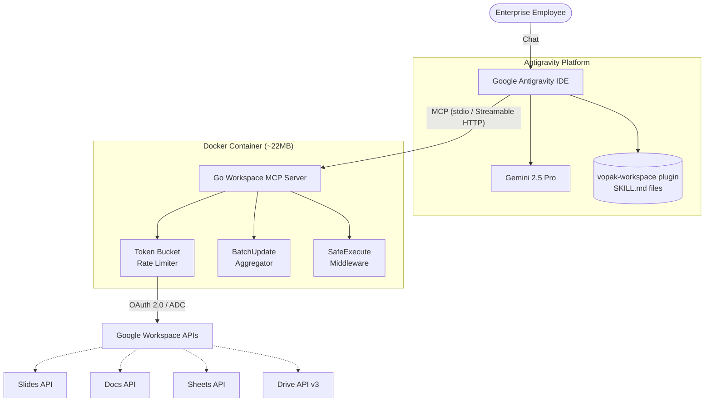

# Architecture Design Document: Vopak Workspace MCP Platform

| Field | Value |
|:------|:------|
| **Document Owner** | Patricio Santamaria |
| **Version** | 2.0.0 |
| **Date** | June 2026 |
| **Status** | Draft — Pending Review |
| **Supersedes** | vopak-mcp v1.x (Python/FastMCP) |

---

## 1. Executive Summary

This document defines the architecture for the **Vopak Workspace MCP Server** — an enterprise-grade Go backend that provides Google Workspace automation tools to AI agents via the Model Context Protocol (MCP).

The system enables employees to create pixel-perfect corporate-branded Google Slides, Docs, Sheets, and Drive folder structures through natural language interaction within Google Antigravity IDE.

### Key Architectural Decisions

| Decision | Rationale |
|:---------|:----------|
| **Go** over Python | Single binary, goroutines for concurrent API fan-out, ~22MB Docker image vs ~800MB, eliminates gws CLI dependency |
| **Official MCP Go SDK** | `github.com/modelcontextprotocol/go-sdk` v1.6+ — maintained by MCP project + Google, type-safe struct-based tools |
| **Template-Injection** over generative rendering | LLMs cannot reliably generate pixel-accurate layouts; templates guarantee brand compliance |
| **Self-contained over preview servers** | Single Docker container replaces Google's developer-preview MCP servers — one ADC, no GCP project dependency |
| **Antigravity as orchestrator** | No custom frontend, agent brain, or job queue needed — Antigravity provides all three |

---

## 2. Core Architectural Principles

### 2.1 Template-Injection Pattern

The AI **never** generates absolute layout dimensions (X/Y coordinates, font sizes, hex colors). Instead:

1. Corporate design team maintains **Master Templates** in Google Drive
2. Templates contain `{{PLACEHOLDER}}` text tags and `{{DYNAMIC_ZONE}}` bounding boxes
3. The MCP server replaces placeholders with AI-generated content
4. Google Workspace handles all pixel-perfect rendering

### 2.2 Bounding Box Spatial Control

For dynamic content (charts, data visualizations), transparent shapes with Alt-Text identifiers (e.g., `{{DYNAMIC_ZONE_1}}`) define spatial boundaries. The server extracts X/Y/Width/Height from these shapes to constrain injected content precisely.

### 2.3 Decoupled Skills as Code

Agent reasoning instructions are stored as version-controlled `SKILL.md` Markdown files in the `plugin/skills/` directory, completely decoupled from the Go binary. Skills are loaded by Antigravity at session start — no server restart required when updating agent instructions.

### 2.4 Controlled Concurrency

Go manages simultaneous API calls via `errgroup`, strictly governed by:
- **Token Bucket rate limiter** (`golang.org/x/time/rate`) — prevents API quota exhaustion
- **BatchUpdate aggregation** — coalesces multiple mutations into single HTTP requests

---

## 3. System Topology



### 3.1 Antigravity-Provided Capabilities

| Capability | Provided by |
|:-----------|:-----------|
| Agent orchestration | Antigravity IDE agent runtime |
| LLM inference | Gemini 2.5 Pro (cloud) |
| User interface | Antigravity chat + artifacts |
| Async task management | Antigravity background tasks |
| Skill/plugin loading | Antigravity plugin system |
| User authentication | Antigravity session (Google OAuth) |

### 3.2 Custom Components

| Component | Technology |
|:----------|:----------|
| MCP Server binary | Go 1.25+ with official MCP Go SDK (`github.com/modelcontextprotocol/go-sdk` v1.6+) |
| Granular tools (46) | `google.golang.org/api/*` (Slides, Docs, Sheets, Drive) |
| workspace-api bridge (3 generic) | Direct REST via Google Discovery API (Gmail, Calendar, Forms, Tasks, Admin, etc.) |
| Rate limiting middleware | `golang.org/x/time/rate` |
| BatchUpdate aggregator | Go channels + `errgroup` |
| Docker container | Multi-stage Alpine (~22MB) |
| Agent skills (10 — see Section 8) | Markdown SKILL.md files |

---

## 4. MCP Server Architecture

### 4.1 Server Groups

The Go binary exposes **6 logical MCP servers**, each with scoped tools:

| Server | Tools | OAuth Scopes | Purpose |
|:-------|:-----:|:-------------|:--------|
| `workspace-slides` | 14 | `presentations`, `spreadsheets`, `drive` | Granular Slides API tools |
| `workspace-docs` | 12 | `documents`, `drive` | Granular Docs API tools |
| `workspace-sheets` | 5 | `spreadsheets`, `drive` | Granular Sheets API tools |
| `workspace-drive` | 2 | `drive` | Drive search & folder management |
| `workspace-branded` | 3 | `presentations`, `documents`, `drive` | Template-based branded content |
| `workspace-api` | 3 | All scopes (per-request) | Generic REST bridge for any Workspace API |

**Total: 39 tools** in a single binary, selectable via `--server` flag. Rare operations (insert shape, set background, speaker notes, page breaks, etc.) are available through `batch_update` escape hatches or the `api_*` bridge.

The `workspace-api` bridge replaces Google's developer-preview MCP servers (`gws-gmail`, `gws-calendar`, etc.), providing access to **any** Workspace REST API (Gmail, Calendar, Forms, Tasks, Admin, Groups) through 3 verb-gated tools — no additional GCP project required.

### 4.2 Tool Design Philosophy

Tools are high-level, business-intent operations — **not** raw API wrappers:

| ❌ Low-level (avoid) | ✅ High-level (preferred) |
|:---------------------|:------------------------|
| `CreateShape(x, y, w, h)` | `slides_insert_chart(zone_tag, chart_config)` |
| `InsertText(offset, text)` | `docs_replace_text(doc_id, old, new)` |
| `UpdateCells(range, values)` | `sheets_write_data(sheet_id, data, range)` |

### 4.3 Middleware Stack

Every tool invocation passes through three middleware layers:

```
Antigravity → MCP Request
                │
                ▼
        ┌─── SafeExecute ────┐
        │  Catch panics       │
        │  Structured errors  │
        │  AgentResult JSON   │
        └────────┬────────────┘
                 │
        ┌─── BatchAggregator ──┐
        │  Coalesce mutations   │
        │  Flush as single      │
        │  BatchUpdate request  │
        └────────┬──────────────┘
                 │
        ┌─── TokenBucket ──────┐
        │  Wait for token       │
        │  5 req/s, burst 10    │
        │  Exponential backoff  │
        └────────┬──────────────┘
                 │
                 ▼
          Google Workspace API
```

---

## 5. Dynamic Content Strategies

### 5.1 CSS-to-EMU Native Translation (Primary)

The agent designs slide content using HTML/CSS blueprints. The Go server translates CSS properties to native Google Slides API elements:

- CSS `px` → EMU (1px = 9525 EMU)
- CSS `color` → Slides `RgbColor`
- CSS `font-family` → Slides `fontFamily`
- CSS `border-radius` → Not supported natively; approximated

**Advantage:** Produces fully editable native Slides elements.

### 5.2 Bounding Box Zone Injection (Secondary)

For complex data visualizations that exceed native Slides capabilities:

1. Agent generates structured data (JSON)
2. Server finds the `{{DYNAMIC_ZONE_N}}` shape by Alt-Text
3. Server extracts bounding coordinates
4. Content is injected within those bounds

### 5.3 Native Sheets-to-Slides Chart Linking (Planned)

For employee-editable charts:

1. Server creates a hidden Google Sheet with the data
2. Server generates a native chart in the Sheet
3. Server embeds the linked chart into the slide zone via `CreateSheetsChartRequest`

**Advantage:** Employees can edit chart data post-generation.

---

## 6. Security Model

### 6.1 Authentication

| Phase | Method | File Ownership |
|:------|:-------|:---------------|
| Development | Application Default Credentials (ADC) via `gcloud auth` | Service account bot |
| Production | OAuth 2.0 Domain-Wide Delegation (User Impersonation) | Logged-in employee |

### 6.2 Scoped OAuth

Each server group requests only the minimum OAuth scopes it needs. No shared scope pool.

### 6.3 HITL for Destructive Operations

All tools tagged `DESTRUCTIVE` in their MCP description require explicit human confirmation in Antigravity before execution. The Go server does **not** enforce this — Antigravity's IDE does via the `DESTRUCTIVE` label detection.

### 6.4 Input Sanitization

Unlike the Python predecessor (which shelled out to `gws` CLI), the Go server calls Google APIs directly. There is **no shell execution** and therefore **no shell injection surface**.

---

## 7. Deployment Architecture

### 7.1 Phase 1: Local Docker (Current)

```yaml
# docker-compose.yml
services:
  workspace-mcp:
    build: .
    container_name: vopak-workspace-mcp
    restart: unless-stopped
    volumes:
      - ${HOME}/.config/gcloud:/root/.config/gcloud:ro
```

Antigravity connects via `docker exec -i vopak-workspace-mcp /app/server --server slides`.

### 7.2 Phase 2: Cloud Production (Future)

The same Go binary deploys to **Google Cloud Run** with Streamable HTTP transport:

| Component | Local (Phase 1) | Cloud (Phase 2) |
|:----------|:----------------|:----------------|
| Binary | Same | Same |
| Transport | stdio (via docker exec) | Streamable HTTP |
| Auth | ADC (service account) | Workload Identity |
| Scaling | Single container | Auto-scale 0→N |
| Secrets | `.env` file / Docker volume | Secret Manager |

**Zero code changes** between phases — only infrastructure configuration.

---

## 8. Plugin Architecture

The project ships an Antigravity plugin (`plugin/`) alongside the MCP server:

```
plugin/
├── plugin.json                  # Plugin manifest
└── skills/
    ├── tool_guard/              # ALWAYS ACTIVE — granular tools first, API fallback
    ├── api_reference/           # Syntax reference for api_read/write/delete
    ├── content_editor/          # Edit existing Slides/Docs/Sheets
    ├── doc_creator/             # Create branded Google Docs
    ├── slide_designer/          # Design branded presentations
    ├── setup_guide/             # Docker install & config guide
    ├── template_picker/         # Pick the right template from registry
    ├── layout_planner/          # Visual variety for slide decks
    ├── chart_builder/           # Data-driven charts (no hallucination)
    └── brand_checker/           # Post-generation brand compliance
```

Skills are **installed by symlinking** the `plugin/` directory into `~/.gemini/config/plugins/vopak-workspace`. They teach the agent **how** to use the MCP tools — the server provides the tools, the skills provide the strategy.

---

## 9. Migration from Python v1

| Aspect | Python v1 (vopak-mcp) | Go v2 (vopak-workspace-mcp) |
|:-------|:---------------------|:---------------------------|
| Language | Python 3.11 + FastMCP | Go 1.25+ + official MCP Go SDK |
| Docker image | ~800MB (Rust gws + gcloud + Python) | ~22MB (Go binary + Alpine) |
| CLI dependency | Shells out to `gws` Rust binary | Direct Google API calls |
| GCP tools | Included (3 CLI wrappers) | **Removed** — separate project |
| Workspace API bridge | 3 CLI wrappers (gws_read/write/destructive) | 3 Go tools (api_read/api_write/api_delete) |
| Google preview servers | N/A | **Not required** — workspace-api bridge covers all APIs |
| Tool count | 42 (workspace + GCP) | 49 (workspace only) |
| Skill count | 4 (separate plugin) | 10 (co-located in `plugin/`) |
| Transport | stdio only | stdio + Streamable HTTP |
